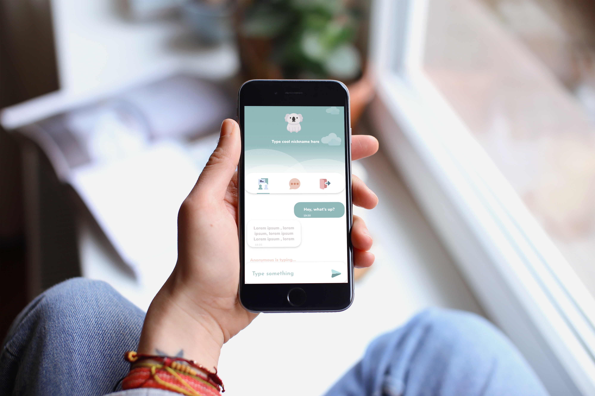

# Cool Koala Chat App

## Share your thoughts
This is an online real-time Chat Application. You can send messages to the large amount of people just like you would in the group chat. You can share your nickname or stay incognito. Why Koala? Because they are  awesome animals that suffered from a massive Australian fire in Jan 2020. 
## Log in
To log in type your username and password.
Log in credentials for test user:
 * **Username**:Trevor
 * **Password**:123


## Just join the chat

Just join the chat and enjoy your conversations.



## Getting started
* Clone the Repo ```git clone```
* Install NODE ``` npm install```
* Open MAMP/WAMP
* Go to MyPhpAdmin```-> create new database```
* Import the nodelogin database from db folder
* In the Terminal run ``` node app.js```
* In the Browser go ``` localhost:3030```

## Deployment
The app is live and available at https://vira-romanko-chatapp.herokuapp.com


## Build with/ Tools
* **HTML5**
* **SASS/CSS3**
* **JavaScript**
* **Node.js**
* **Express**
* **Gulp**
* **Vue.js**
* **Socket.io**


## Workspace (development)
* Visual Studio Code
* Terminal
* GitHub
* Localhost

## Workspace (design)
* Adobe XD
* Adobe Photoshop/Illustrotor


## Authors
* **Vira Romanko** -*Developer/Designer*


## Acknowledgment/References

* **Pinterest/Dribbble/Google** - *Design inspiration/images* 

## Future Plans
* make privat room chatting
* show who just joined the room
* add sign up (not just log in)
